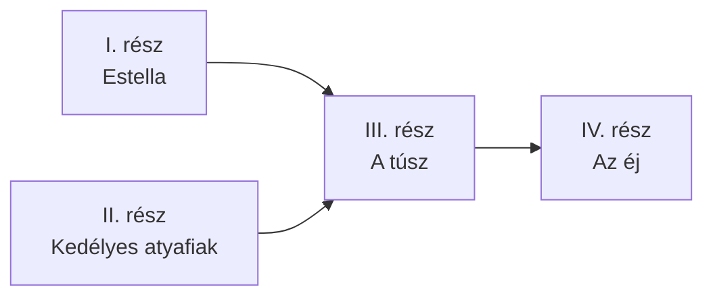

### Életrajzok
#### Madách Imre (1823 - 1864)
Alsósztregován született
Apja halála után anyja irányította a birtokot → anyagi függetlenség
Váci piarista gimnázium (magán úton), pesti egyetem (jog, szellemi életbe kerül)
Latinul, németül és franciául olvasott
Első verseskötete: Lantvirágok
Nógrád megyében (Balassagyarmaton) hivatalnok
Feleségül vette Fráter Erzsébetet - 3 gyermek
A szabadságharc után Kossuth titkárát bújtatta, amiért feljelentették és bebörtönözték
Bizonyíték hiányában ejtették a vádat, de Pesten kellett maradnia
Házassága távollétében megromlott, felesége elvált tőle
Az 1860-as években újból hivatali szerepet vállalt
#### Mikszáth Kálmán (1847 - 1910)
Szklabonyán született, tájait, színeit, hangulatát élete végéig őrizte
Rimaszombati református kollégium, selmecbányai evangélikus lícium, pesti egyetem (jog, de nincs diploma)
Balassagyarmaton Mauks Mátyás mellett esküdtként dolgozik - dzsentrik, Mauks Ilona
Mauks Ilonát apja belegyezése nélkül feleségül veszi, Pestre költöznek
Anyagi gondok → válás, Ilona visszaköltözik a szülői házba
Pesti Hírlapnak dolgozott
A tót atyafiak, A jó palócok - siker
Petőfi Társaság, Kisfaludy Társaság, Magyar Tudományos Akadémia tagja lett
Országgyűlési képviselő lett
Későbbi műveiben ironikus hangnem, a kor társadalmi problémái jelennek meg
### Fogalmak
#### Drámai költemény
A romantika korában vezető szerepbe kerülő, líra és dráma műnemébe tartozó műfaj
Eredetileg olvasásra szánt
Színpadra vitele nehézkes
Az emberiség kérdéseire keres választ (Van-e az életnek értelme, és ha igen, akkor mi az?)
Filozófiai kérdéseket feszeget
#### Novella
Reneszánsz korban kialakult epikus műfaj (Boccaccio: Dekameron)
Kevés szereplővel, kevés helyszínen rövid idő alatt történik
Egy cselekményszál
Főhős életében fordulat
Csattanóval zárul
#### Elbeszélés
Tudatosan a romantika korában jelentkezik
Hosszabb idő, mint a novella
Lehet több cselekményszál
Általában van fordulat, csattanó, de nem szükséges
### Művek
| Szerző          | Cím                            | Műfaj                |
| --------------- | ------------------------------ | -------------------- |
| Madách Imre     | Lantvirágok                    | verseskötet          |
| Madách Imre     | Az ember tragédiája            | drámai költemény     |
| Madách Imre     | A civilizátor                  | komédia              |
| Madách Imre     | Mózes                          | dramatizált eposz    |
| Mikszáth Kálmán | A tót atyafiak                 | novellakötet         |
| Mikszáth Kálmán | A jó palócok                   | novellakötet         |
| Mikszáth Kálmán | Országgyűlési karcolatok       | karcolat             |
| Mikszáth Kálmán | A gavallérok                   | kisregény            |
| Mikszáth Kálmán | Két választás Magyarországon   | novellafüzér         |
| Mikszáth Kálmán | Különös házasság               | történelmi regény    |
| Mikszáth Kálmán | A fekete város                 | történelmi regény    |
| Mikszáth Kálmán | Mikor a mécses már csak pislog | elbeszélésgyűjtemény |
| Mikszáth Kálmán | Fili                           | elbeszélés           |
| Mikszáth Kálmán | Sipsirica                      | elbeszélés           |

### Beszterce ostroma
Romantikus, realista (kis)regény

##### Pongrácz jellemzése
A regény többi szereplőjéhez képest róla teljes képet kapunk
A kulcskérdés az, hogy különc-e vagy bolond?
A regény III. részében bekövetkezett párbajig csak hóbortos ember, aki tudatosan teremt egy letűnt világot
"Én nem akarok a XIX. században élni, visszamegyek a XVII.-be, mert nekem úgy tetszik"
A párbaj után azonban nem épült fel teljesen, egyes szavai és tettei már inkább őrültségre vallanak
**Lovagi erényei - szilárd értékrendre vall**
- Ősök tisztelete
- Gyengék és a nők védelme és eszményítése
- Bőkezűsége, nagyvonalúsága különbbé teszik a folyton marakodó és egymásra licitáló Trnowszkynál (ők hivatottak képviselni a XIX. századi polgárságot) és a gátlástalan, másokon élősködő Behenczyekél (Gentry réteg)
### Az ember tragédiája
##### Szerkezet
Keretes szerkezet:
- 1-3. szín - biblikus színek / keretszínek
	- 1. szín - A mennyekben
	- 2. szín - A paradicsomban
	- 3. szín - Pálmás vidék a paradicsomon kívül (kiűzetés)
- 4-14. szín - történeti színek / álomszínek
	- 4-6. szín - ókor
		- 4. szín - Egyiptom
		- 5. szín - Athén
		- 6. szín - Róma
	- 7. szín - Konstantinápoly - középkor
	- 8. szín - Prága I. - középkor alkonya
	- 9. szín - Párizs - "álom az álomban"
	- 10. szín - Prága II. - középkor alkonya
	- 11. szín - London - Madách jelene
	- 12-14. szín - Madách jövőképe
		- 12. szín - falanszter
		- 13. szín - űr
		- 14. szín - eszkimó
- 15. szín - biblikus szín / keretszín
	- 15. szín - Pálmás vidék a paradicsomon kívül (3. szín folytatása)
##### Filozófiai háttere
Csak a történeti színekben fedezhető fel
Hegeli dialektika → hegeli triáda
- Minden történeti szín elején Ádám lelkesedik egy eszméért (tézis)
- Ez az eszme az ellentétébe (antitézis) csap át
- Éva jelenti a megoldást (szintézis)
- A következő szín eszméje a megoldás
![[Romantika 2024-01-25 12.30.47.excalidraw]]